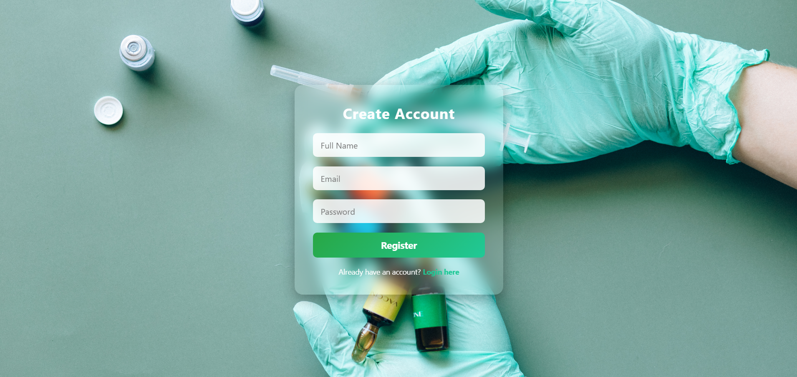
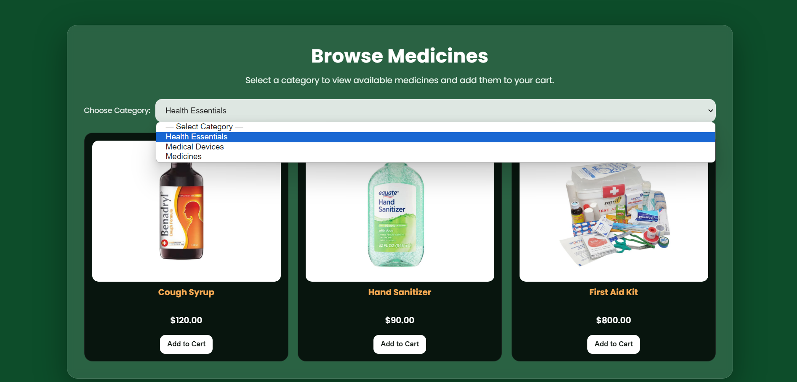
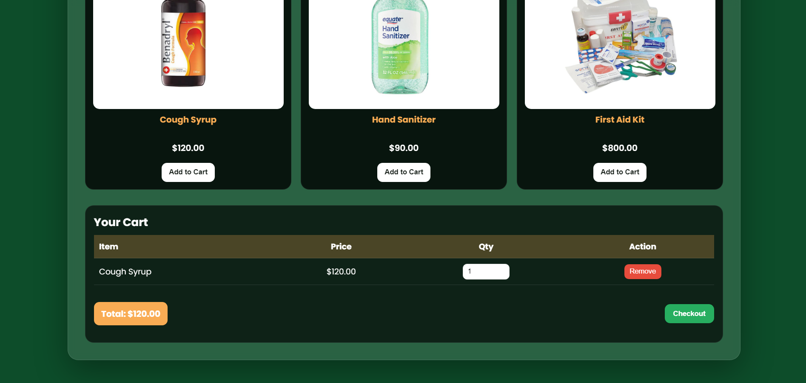
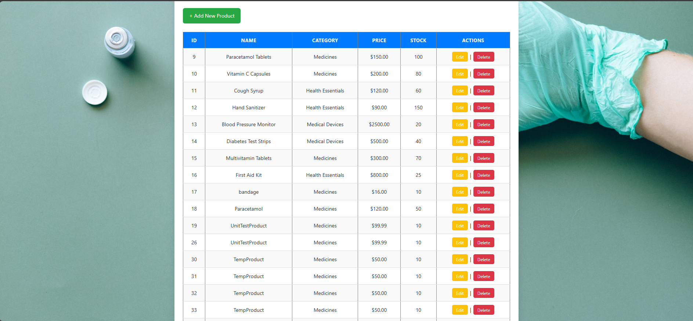
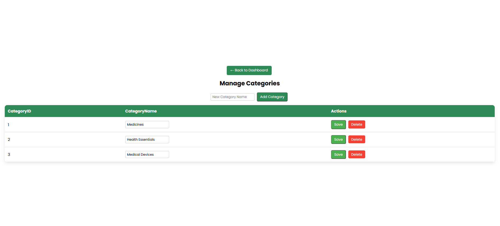
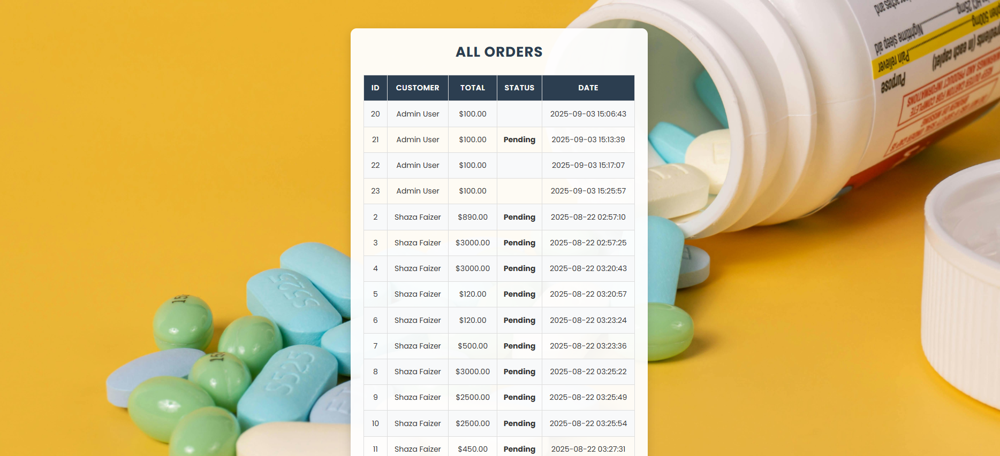
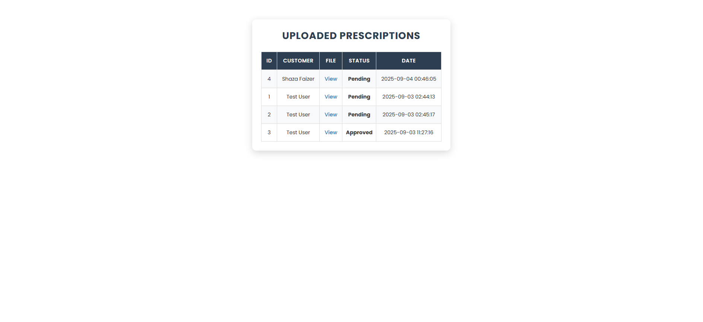
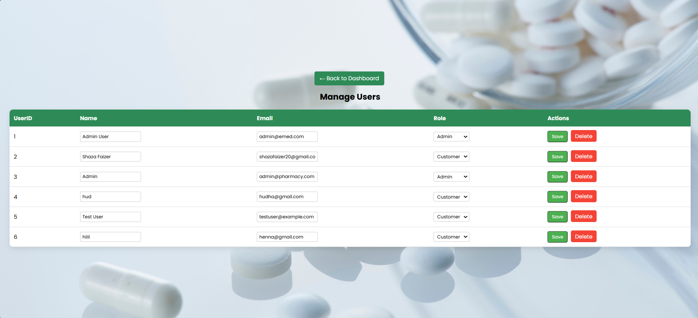

# 💊 eMed-Pharmacy

**eMed-Pharmacy** is a responsive online pharmacy platform designed to provide users with easy access to medicines and prescription management. It features a secure user system, cart & checkout, admin management of products and orders, and prescription uploads—all built with PHP, MySQL, and CSS.  

## 🧰 Tech Stack
- **Front-end:** HTML5, CSS3  
- **Back-end:** PHP  
- **Database:** MySQL (`db.php` integration)  
- **Design:** Custom CSS  

## 🚀 Key Features
- 👤 **User Authentication:** Secure login and registration system.  
- 🛒 **Cart & Checkout:** Add medicines to cart and process orders.  
- 💊 **Product Management:** Admin can add, edit, and remove products.  
- 🧾 **Orders Management:** Admin can view and manage orders.  
- 📝 **Prescription Upload:** Users can upload prescriptions for validation.  
- 🖥 **Admin Dashboard:** Centralized control over products, orders, and prescriptions.  

## 📁 File Structure Highlights
| File                     | Purpose                                         |
|---------------------------|------------------------------------------------|
| `index.php`               | Homepage / product listing                     |
| `product.php`             | Individual product detail page                 |
| `cart.php`                | Shopping cart page                             |
| `checkout.php`            | Order processing                               |
| `register.php`            | User registration                              |
| `login.php`               | User login                                     |
| `logout.php`              | User logout                                    |
| `upload_prescription.php` | Upload prescription functionality             |
| `admin_dashboard.php`     | Admin main dashboard                           |
| `admin_add_product.php`   | Add new products                               |
| `admin_edit_product.php`  | Edit existing products                          |
| `admin_products.php`      | List of all products                            |
| `admin_orders.php`        | View/manage user orders                          |
| `admin_prescriptions.php` | View/manage prescriptions                       |
| `db.php`                  | Database connection setup                        |
| `functions.php`           | Common PHP functions                             |
| `style_admin.css`         | Admin panel styling                              |
| `style_customer.css`      | Customer-facing styling                          |
| `header.php` / `footer.php` | Common page layout elements                   |

## 🛠 How to Run Locally

1. Start your local server (XAMPP/WAMP/MAMP):  
   - Enable **Apache** and **MySQL**.

2. Import the database:  
   - Open [http://localhost/phpmyadmin](http://localhost/phpmyadmin).  
   - Create a new database (example: `emedpharmacy`).  
   - Import the provided database SQL file.

3. Move the project into your server directory:  
   - Example: `xampp/htdocs/pharmacy`.

4. Open the project in your browser:  
   - [http://localhost/emed-pharmacy/](http://localhost/pharmacy/)

## 📸 Screenshots

### 🏠 Home Page
  
  
  
  
  
  

### 🔐 Login Page
  

### 🔐 Register Page
  

### 🛒 Product Pages
  
  

### 🧾 Checkout Page
  

### 🏢 Admin Dashboard
  
  
  
  
  
  

### 💊 Upload Prescription
  

## 👩‍💻 About the Developer
## 👩‍💻 About the Developer

**Shaza Faizer** is a final-year Software Engineering student with hands-on experience in **PHP web development**, **UI/UX design**, and building **practical, user-friendly web solutions**. Passionate about creating responsive and dynamic web applications, Shaza focuses on combining **clean code, intuitive interfaces, and functional design** to deliver seamless user experiences.  

Actively pursuing opportunities in **full-stack web development, UI/UX projects, and practical software solutions**.

## 📬 Contact
- 📧 Email: `shazafaizer20@gmail.com`  
- 🌐 [LinkedIn](https://www.linkedin.com/in/shaza-faizer-bb5abb2b4)

